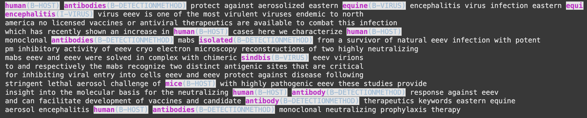

## Virus-Host Interaction Dataset for Named Entity Recognition

**📖 Overview**  
Zoonotic diseases pose an increasing threat to global health, yet much knowledge remains locked in the text of scientific publications. This repository presents a novel, manually annotated dataset for the automated recognition of named taxonomic and other entities relevant to virus-host associations. This dataset serves as a Gold Standard Corpus for training future NER models and aims to facilitate the extraction of host-pathogen detection methods from scientific literature.

🚀   
The rapid emergence of novel zoonotic diseases highlights the critical need for efficient information extraction methods. Traditional approaches to detecting host-pathogen interactions are often limited by the manual nature of the analysis, leading to slow progress in understanding and preventing zoonotic spillovers. The challenge lies in harnessing the vast amount of information available in published research to improve disease risk predictions.
To address these challenges, we propose a comprehensive approach using Named Entity Recognition (NER) techniques to extract vital information about host-pathogen interactions from scientific texts. Our solution involves:

**Creation of a Novel Dataset** : We built a dataset comprising 1,104 articles reporting virus detection results in mammal hosts, with 524 abstracts manually annotated for NER tasks.

**Utilization of Pretrained Models:** We employed pretrained transformer models (BERT-based) fine-tuned on our dataset, significantly enhancing the accuracy of entity recognition related to viruses and their hosts.

**🗂️ Dataset Details**  
Dataset Composition: The dataset includes abstracts manually collected and annotated from a systematic literature review of known viruses associated with mammal hosts, filtered from major databases (Web of Science, Google Scholar, PubMed).

Annotation Process: **Using the Inside, Outside, Beginning (IOB)** tagging format, entities were meticulously annotated, allowing for high-quality training of NER models. Annotations were performed using the UBIAI tool.

Gold Standard Corpus: This dataset is proposed as **a Gold Standard Corpus for future NER model training**, facilitating advancements in the automated extraction of virus-host detection methods.

📊 Results
Our evaluation demonstrates the effectiveness of the pretrained models on our dataset, with the following performance metrics:

Model	Accuracy	Precision	Recall	F1-Score
Transformer	0.9826	0.9793	0.9826	0.9795
BioRedditBERT	0.9814	0.9772	0.9814	0.9770
SapBERT	0.9857	0.9870	0.9857	0.9853
Biobert_ncbi_disease_ner	0.9846	0.9840	0.9846	0.9832

SapBERT exhibited the best performance, demonstrating its capability in recognizing taxonomic names and detection methods.  

🛠️ Skills Utilized

Dataset Creation & Annotation: Expertise in constructing high-quality datasets for NER tasks, including manual annotation and preprocessing techniques.  
Deep Learning & NLP. 

🔗 Future Work
This work lays the groundwork for further exploration of NER in the biological sciences, including:

Expanding the dataset to include additional entities such as geographical locations and species migration.
Automating the annotation process for full-text articles using semi-supervised learning methods.
Integrating knowledge graphs to enhance the interpretation of taxonomic relationships and improve inference techniques.

Publication: https://arxiv.org/abs/2305.13317
